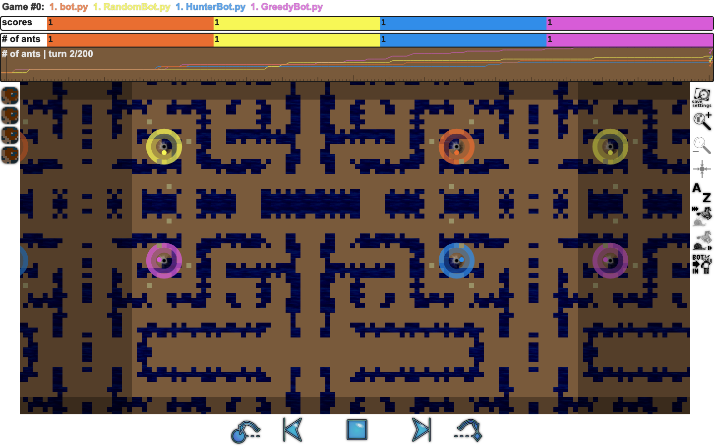

# Ants Strategy Agent

A deterministic strategy bot and local development environment for the 2011
[Ants AI Challenge](https://ants.aichallenge.org/). The repository includes a
game engine, several bot implementations, fixed opponents, repeatable match
runners, benchmark tooling, and a browser replay viewer.



## Quick start

The project uses [uv](https://docs.astral.sh/uv/) to manage Python dependencies.

```bash
git clone https://github.com/T-Py-T/ants-strategy-agent.git
cd ants-strategy-agent
uv sync --all-extras

make pytest
make test
make visualize-evidence
```

`make test` runs a short game through the local engine. The visualization
command opens the retained replay shown above, including fog of war, score
history, playback controls, and the full map state.

Docker and a VS Code dev container are also available:

```bash
make docker-build
make docker-test
```

Optional dependency groups let you install only the tools you need:

| Extra | Includes | Use |
| --- | --- | --- |
| `[test]` | pytest and coverage support | Unit and integration tests |
| `[analysis]` | pandas, NumPy, SciPy, Matplotlib, and Seaborn | Benchmark analysis and plots |
| `[dev]` | Test and analysis dependencies plus pre-commit | Complete contributor environment |

## How the bot works

The default `AdvancedBot` chooses one action for each available ant using a
priority-based policy:

```text
game state
    │
    ▼
continue valid standing orders
    │
    ▼
protect colony growth
    │
    ▼
attack enemy hills / collect food / engage / explore
    │
    ▼
collision-safe orders
    │
    ├──► local engine and sandbox
    └──► replay and match result
```

The policy tracks previously issued orders, food targets, enemy hills,
exploration state, and planned destinations. Movement is resolved before
orders are emitted so multiple ants do not choose the same square.

The repository also contains `InfluenceBot`, whose historical class name is
`IForOneWelcomeOurNewInsectOverlords`. It uses influence maps for food,
unexplored territory, combat safety, defense, and coordinated movement. See
[docs/STRATEGY_LINEAGE.md](docs/STRATEGY_LINEAGE.md) for its origin and the
adaptations made for the current engine.

## Bots

| Bot | File | Purpose |
| --- | --- | --- |
| `AdvancedBot` | [`src/bots/bot.py`](src/bots/bot.py) | Current default hierarchical strategy |
| `InfluenceBot` | [`src/bots/influence_bot.py`](src/bots/influence_bot.py) | Recovered influence-map strategy adapted to the current protocol |
| `XathisBot` | [`src/bots/xathis_bot.py`](src/bots/xathis_bot.py) | Partial Python adaptation used as an algorithmic comparison target |
| Sample opponents | [`src/sample_bots/`](src/sample_bots) | Random, greedy, hunter, lefty, and other fixed baselines |

The preserved Java Xathis source is under
[`docs/reference/xathis/`](docs/reference/xathis). Xathis is the comparison
target for future reinforcement-learning experiments; it is not the default
bot used by the project.

## Replays and benchmarks

Run individual matchups:

```bash
make test-against-random
make test-against-hunter
make test-vs-xathis
make test-influence-vs-current
make test-influence-vs-xathis
```

Run the benchmark suite or its shorter smoke configuration:

```bash
make benchmark SEED=42
make benchmark-quick SEED=42
make benchmark-influence SEED=42
```

The engine and each bot receive recorded seeds. Repeating a result requires the
same code revision, map, arguments, bot revisions, engine seed, and player seed.

The versioned sample under
[`results/current-evidence-v1/`](results/current-evidence-v1/) contains:

- the benchmark configuration;
- machine-readable aggregate and per-game results;
- raw runner output;
- a replay that opens in the bundled viewer; and
- a manifest covering the retained files.

Open the newest locally generated replay with:

```bash
make visualize-latest
```

## Validation

```bash
make pytest
make test
make validate
```

The test suite covers strategy utilities, protocol parsing, engine behavior,
sandboxing, sample opponents, benchmark outputs, replay handling, and complete
game runs. Contributor setup and the local commit gate are described in
[CONTRIBUTING.md](CONTRIBUTING.md).

## Project Structure

```
src/
├── ants/               # engine, state model, protocol, and sandbox
├── bots/               # AdvancedBot, InfluenceBot, and Xathis adaptation
├── sample_bots/        # fixed opponents in several languages
└── tools/              # match runner and map generation
tests/                  # unit, integration, and game regressions
scripts/                # benchmarks and result analysis
visualizer/             # local browser replay viewer
maps/                   # bundled challenge maps
results/                # versioned result packets
docs/reference/xathis/  # preserved historical Xathis source
```

## Reinforcement-learning track

The current bots are algorithmic. The planned reinforcement-learning track
will train policies from game trajectories and score them against frozen maps,
seeds, turn limits, and algorithmic opponents—including Xathis—using the same
match and replay infrastructure.

## Licensing and provenance

Taylor's original code and the Apache-licensed challenge infrastructure are
available under [Apache License 2.0](LICENSE). Historical Xathis-derived code
and Tim Whitson's original influence-map strategy retain their original terms
and are excluded from the project license where no license grant was found.

See [docs/LICENSING.md](docs/LICENSING.md) and
[THIRD_PARTY_NOTICES.md](THIRD_PARTY_NOTICES.md) for the component-by-component
breakdown. Contributions follow [CONTRIBUTING.md](CONTRIBUTING.md), and security
reports follow [SECURITY.md](SECURITY.md).
