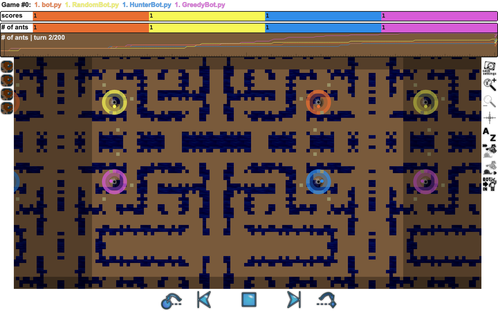

<div align="center">

# Ants Strategy Agent

**Write a colony brain. Drop it on a map. Watch it fight.**

A deterministic strategy bot for the 2011
[Ants AI Challenge](https://ants.aichallenge.org/), bundled with the local game
engine, fixed opponents, seeded match runners, and a browser replay viewer, so
the whole loop runs on your laptop.

[](https://github.com/T-Py-T/ants-strategy-agent/actions/workflows/ci.yml?query=branch%3Amain)

[Getting started](#getting-started) ·
[Demo](#demo-play-a-match-then-replay-one) ·
[How the bot thinks](#how-the-bot-thinks) ·
[Benchmarks](#benchmarks-and-the-retained-result-packet) ·
[Contributing](#contributing)



<sub>A retained four-player game (<code>bot.py</code> vs RandomBot, HunterBot, and GreedyBot), rendered by the bundled viewer.</sub>

</div>

## Why you might like it

- **The whole arena, offline.** Engine, protocol, sandbox, maps, opponents and
  viewer live in one repository. No server, no account, no upload.
- **Seeded and repeatable.** The engine and every bot get recorded seeds, so a
  match can be replayed from the same revision, map and arguments.
- **Several brains to compare.** A priority-based default bot, a recovered
  influence-map bot, a partial Python port of the 2011 winner, and a bench of
  simple sample opponents.
- **Replays you can scrub.** Every game writes a `.replay` file that opens in
  the browser viewer with fog of war, score history and turn controls.
- **Honest numbers.** Results come from files you can rerun and diff, not from
  prose in this README.

## Getting started

### Prerequisites

- Python 3.12 or newer
- [uv](https://docs.astral.sh/uv/) (or `make install-uv`)
- `make`
- A web browser for the replay viewer
- Optional: Docker or Podman for the container path

### Install and check

```bash
git clone https://github.com/T-Py-T/ants-strategy-agent.git
cd ants-strategy-agent
uv sync --all-extras

make pytest           # full unit and integration suite
uv run make test      # one 30-turn, two-player game through the local engine
```

`make test` calls `python3` directly, so run it through `uv run` (or activate
`.venv` first) to use the synced environment.

Optional dependency groups let you install only what you need:

| Extra | Includes | Use |
| --- | --- | --- |
| `[test]` | pytest and coverage support | Unit and integration tests |
| `[analysis]` | pandas, NumPy, SciPy, Matplotlib, and Seaborn | Benchmark analysis and plots |
| `[dev]` | Test and analysis dependencies plus pre-commit | Complete contributor environment |

### Container path (not run for this README)

```bash
make docker-build
make docker-test
```

Both targets use Podman when it is installed and Docker otherwise. CI builds
the image and runs `make test` inside it.

## Demo: play a match, then replay one

**1. Play a quick game.** Your bot (`src/bots/bot.py`) takes on RandomBot for
30 turns on a two-player maze:

```bash
uv run make test
```

The run streams per-turn stats and ends with a single machine-readable line:

```text
RESULT game_id=0 turns=30 winner=tie(player_0,player_1) player_0=bot.py:rank=0,score=1,status=survived player_1=RandomBot.py:rank=0,score=1,status=survived
```

Thirty turns is a smoke test, not a contest, so a tie is the normal outcome.
The replay lands in `game_logs/`.

**2. Open the retained four-player replay.** This is the game in the
screenshot above:

```bash
# writes results/current-evidence-v1/replay/replay.html without opening a browser
uv run python visualizer/visualize_locally.py \
  results/current-evidence-v1/replay/four-player-final.replay --nolaunch

# same file, opened in your default browser (not run for this README)
make visualize-evidence
```

**3. Replay your own game** (not run for this README; opens a browser):

```bash
make visualize-latest
```

**4. Pick a fight.** Each matchup is a single seeded game (not run for this
README):

```bash
make test-against-random
make test-against-hunter
make test-vs-xathis
make test-influence-vs-current
make test-influence-vs-xathis
```

`make help` lists every target, including full 1000-turn games, self-play and
statistical sweeps.

## How the bot thinks

The default `AdvancedBot` gives each free ant exactly one order per turn,
working down a priority list:

```text
game state
    │
    ▼
continue valid standing orders
    │
    ▼
protect colony growth
    │
    ▼
attack enemy hills / collect food / engage / explore
    │
    ▼
collision-safe orders
    │
    ├──► local engine and sandbox
    └──► replay and match result
```

It remembers issued orders, food targets, enemy hills, exploration state and
planned destinations. Movement is resolved before orders are sent, so two ants
never step onto the same square.

`InfluenceBot` (historical class name `IForOneWelcomeOurNewInsectOverlords`)
takes a different approach: influence maps for food, unexplored territory,
combat safety, defence and coordinated movement. Its origin and the protocol
adaptations it needed are in
[docs/STRATEGY_LINEAGE.md](docs/STRATEGY_LINEAGE.md).

## Bots

| Bot | File | Role |
| --- | --- | --- |
| `AdvancedBot` | [`src/bots/bot.py`](src/bots/bot.py) | Default priority-based strategy |
| `InfluenceBot` | [`src/bots/influence_bot.py`](src/bots/influence_bot.py) | Recovered influence-map strategy, adapted to the current protocol |
| `XathisBot` | [`src/bots/xathis_bot.py`](src/bots/xathis_bot.py) | Partial Python adaptation of the 2011 winner, used as a comparison opponent |
| Sample opponents | [`src/sample_bots/`](src/sample_bots) | Random, greedy, hunter, lefty, hold and other fixed baselines |

The original Java Xathis source is preserved under
[`docs/reference/xathis/`](docs/reference/xathis) as a reference. `XathisBot`
is a partial port, so results against it describe that port, not the
historical leaderboard winner.

## Benchmarks and the retained result packet

Run a benchmark suite, or its short smoke configuration:

```bash
make benchmark-quick SEED=42      # 2 games per matchup, 200-turn cap
make benchmark SEED=42            # 5 games per matchup, 1000-turn cap (not run for this README)
make benchmark-influence SEED=42  # InfluenceBot as the bot under test (not run for this README)
```

`benchmark-quick` took about 40 seconds on a laptop and writes a Markdown
summary to `benchmark_results/`.

[`results/current-evidence-v1/`](results/current-evidence-v1/) is a frozen,
inspectable packet from one recorded run. It holds the benchmark config,
machine-readable aggregate and per-game results, raw runner output, the
four-player replay shown above, an environment record, and a manifest that
hashes every file. It records 14 games against fixed local opponents, all
draws. That is the whole observed result: no wins, and no claim that the bot
is strong or weak. The packet's own
[README](results/current-evidence-v1/README.md) explains how to reproduce it.

Repeating any result needs the same code revision, map, arguments, bot
revisions, engine seed and player seed.

## Project Structure

```
src/
├── ants/               # engine, state model, protocol, and sandbox
├── bots/               # AdvancedBot, InfluenceBot, and Xathis adaptation
├── sample_bots/        # fixed opponents in several languages
└── tools/              # match runner and map generation
tests/                  # unit, integration, and game regressions
scripts/                # benchmarks and result analysis
visualizer/             # local browser replay viewer
maps/                   # bundled challenge maps
results/                # versioned result packets
docs/reference/xathis/  # preserved historical Xathis source
```

## Roadmap

The bots here are algorithmic. A planned reinforcement-learning track would
train policies from game trajectories and score them against frozen maps,
seeds, turn limits and the algorithmic opponents, using the same match and
replay tooling. Nothing in the repository is a trained agent yet. See
[ROADMAP.md](ROADMAP.md) and [docs/OPEN_PROBLEMS.md](docs/OPEN_PROBLEMS.md)
for planned and open work.

## Contributing

Ideas worth trying: a smarter combat model, better exploration, a new
opponent, faster engine paths, or viewer improvements.

1. Fork the repository and create a focused branch.
2. Set up the local commit gate:

   ```bash
   uv sync --all-extras
   uv run --all-extras pre-commit install
   ```

3. Make the change and add tests for anything executable.
4. Run `uv run --all-extras pre-commit run --all-files` and `uv run make test`.
5. Open a pull request against `main` that explains the change and how you
   validated it. If it changes match behaviour, include the seeds, maps and
   replay.

The full guide is in [CONTRIBUTING.md](CONTRIBUTING.md). Please report security
issues privately as described in [SECURITY.md](SECURITY.md).

## Licensing and provenance

Taylor's original code and the Apache-licensed challenge infrastructure are
available under the [Apache License 2.0](LICENSE). Historical Xathis-derived
code and Tim Whitson's original influence-map strategy keep their original
terms. No license grant was found for them, so they are excluded from the
project license.

See [docs/LICENSING.md](docs/LICENSING.md) and
[THIRD_PARTY_NOTICES.md](THIRD_PARTY_NOTICES.md) for the component-by-component
breakdown and exact upstream revisions. Citation metadata is in
[CITATION.cff](CITATION.cff).

## Acknowledgements

- The [AI Challenge](https://github.com/aichallenge/aichallenge) organisers,
  for the original engine, sample bots, maps and viewer
- Mathis Lichtenberger (Xathis), whose winning bot and postmortem are
  preserved in [`docs/reference/xathis/`](docs/reference/xathis)
- Tim Whitson, author of the original influence-map strategy
